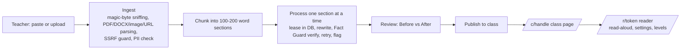

# ReadEasy

**Dense readings, made readable.**

Teachers hand out readings that about one in five students cannot get through: dense paragraphs, long sentences, small print, no help. ReadEasy takes any class reading and turns it into something every student can read, listen to, and understand, then gives the class one link. Students never log in.

Built for the prompt: *choose a product that meaningful groups of people struggle to use, and build a digital product that substantially expands who can successfully use it.* The product is the everyday class handout. The group is students with dyslexia and anyone who reads below grade level.

## Try it in 30 seconds

1. Open the site. The landing page is a live Before/After: pick **Science article**, **History passage**, **Lab assignment**, or **News article**.
2. Left: the handout as students get it. Right: the ReadEasy version. Press **Listen**; each sentence lights up as it is read. Switch **Plain / Simple**, change the font, size, or background.
3. Click **Make the class version** → review → **Sign in** with any email → **Create class link** → **Publish** → open the student link or the QR page on a phone.

Or paste your own text or upload a PDF, Word file, or photo in the box below the demo.

## What it does

**For the teacher**
- Paste, upload (PDF, Word, image, text), and get short titled sections, each with a one-line "In short".
- Two extra reading levels, **Plain** (about grade 7) and **Simple** (about grade 4); the **Original** is always one tap away. A readability grade is shown for each.
- **Fact Guard**: every number, date, percentage, name, and key term in the original is checked against each rewrite. If something is missing, the rewrite is retried; if it still fails, the original wording is kept for that level and the section is flagged with exactly what was dropped. Flags must be acknowledged before publishing.
- TL;DR bullets, "Words to know" with syllable breaks (definitions only when the text itself gives one), assignment steps.
- One class link (`/c/ms-rivera`), a projector QR page, and a 6-character class code.

**For the student** (no account; Chromebook, iPad, phone)
- Big play button; the **current sentence is highlighted** as it is read aloud; tap any sentence to start there; speed control.
- Tap any word to hear it, see its syllables, and a plain definition when the text gave one.
- Reading settings saved on the device: font (Atkinson Hyperlegible, Lexend, OpenDyslexic), text size, letter/word/line spacing, line width, background (cream, pale blue, soft green, dark, high contrast), reading ruler.
- Level switch: Original, Plain, Simple.

**What the evidence says, and how we followed it** (details and sources in `RESEARCH.md`): read-aloud with highlighting has the strongest evidence; wider spacing helps when word spacing scales with letter spacing; short lines help the weakest decoders; syllable breaks help decoding. "Dyslexia fonts" and colored overlays do not hold up in controlled studies, so they are offered as preferences and never claimed as a fix. No deficit language anywhere in the product (a test enforces it).

## How the rewriting works

- **Built-in adapter (default, no keys, no cost).** A rule-based rewriter (`src/lib/text/simplify.ts`): splits long sentences at clauses, replaces about 250 academic words and phrases with everyday ones (with correct verb forms), drops filler, turns buried lists into bullets, and caps Simple sentences near 14 words. It never adds or removes facts. Runs in the browser for the landing demo and on the server for published materials.
- **Claude (optional).** Set `ANTHROPIC_API_KEY` to have Claude do the rewriting with structured outputs, verified by the same Fact Guard. Better at the Simple level; costs a few cents per material.

## Run it locally (no keys)

```bash
pnpm install
cp .env.example .env.local
pnpm dev            # http://localhost:3000
```

That runs a real Postgres in-process (PGlite) with the same migrations and row-level security as production. Nothing is sent anywhere.

## Deploy (Vercel, 3 variables)

1. Get a free Postgres database: Supabase (Project settings → Database → connection string, **transaction** pooler, port 6543) or Neon. Copy the connection string.
2. Create the tables once, from your laptop:
   ```bash
   DATABASE_URL="postgres://..." pnpm db:migrate
   ```
3. Import the repo in Vercel and set:

| Variable | Value |
|---|---|
| `DATABASE_URL` | the connection string from step 1 |
| `DRAFT_COOKIE_SECRET` | any 32+ random characters (`openssl rand -base64 32`) |
| `NEXT_PUBLIC_APP_URL` | `https://<your-vercel-domain>` (no trailing slash) |

4. Deploy. Open `/api/health`; it should say `"db":"postgres"`. Pushes to `main` redeploy automatically.

Sign-in on this setup is a simple email sign-in (no password, no verification), which is right for a demo: nothing sensitive sits behind it. Uploads are stored in Postgres and capped at 4 MB.

**Optional upgrades** (each independent):
- `ANTHROPIC_API_KEY` for Claude rewrites.
- Supabase Auth magic links: `NEXT_PUBLIC_SUPABASE_URL`, `NEXT_PUBLIC_SUPABASE_ANON_KEY`, the email template in `supabase/templates/magic-link.html`, and custom SMTP (Supabase's built-in sender allows ~2 emails/hour).
- Supabase Storage for uploads up to 25 MB: `SUPABASE_SERVICE_ROLE_KEY` and a private bucket named `uploads`.

## Checks

```bash
pnpm check          # lint, typecheck, unit tests, RLS policy tests
pnpm build && MOCK_DB=1 DRAFT_COOKIE_SECRET=local-secret-local-secret NEXT_PUBLIC_APP_URL=http://localhost:3100 pnpm start -p 3100
pnpm test:smoke     # teacher + student flow in a real browser (18 steps, screenshots in test-shots/)
node scripts/axe-check.mjs   # accessibility audit of every screen with axe-core
```

GitHub Actions runs lint, typecheck, unit and RLS tests, the production build, and the browser smoke test on every push.

## Architecture



- **Next.js 16 App Router, TypeScript strict, Tailwind v4.** All colors, sizes, and spacing live in `src/styles/tokens.css`; a test fails the build on raw colors elsewhere, on deficit language in copy, and on any text token under 4.5:1 contrast.
- **Data**: plain SQL through one interface (`src/lib/db`) that sets the JWT claims and `set local role` per request, so Postgres row-level security applies to every query. `postgres.js` in production, PGlite in-process for tests and local dev, same migrations in both. Students never read tables: public pages call `security definer` RPCs keyed by 128-bit share tokens, cached and invalidated on publish.
- **Resumable processing**: sections carry a status and a lease; the client calls `POST /api/materials/[id]/process` until done, so a refresh, a closed tab, or a second tab just continues. One failed section never fails the material.
- **Read-aloud**: browser Web Speech API behind a small interface (`src/lib/tts`), one utterance per sentence, which avoids Chrome's long-utterance cutoff and gives sentence highlighting on every platform; iOS needs the first play inside a tap, which the reader does.
- **Security**: nonce-based CSP, HSTS, frame-ancestors none, no HTML ever stored or rendered from content, rate limits in Postgres, URL import blocks private networks, uploads validated by content not extension.

## Repository guide

| File | What it is |
|---|---|
| `DEMO.md` | 2-minute demo script and the five hardest judge questions. |
| `RESEARCH.md` | Evidence behind the reading-support choices, competitor analysis, technical findings, with sources. |
| `BRAND.md` | The design system: mark, palette with contrast ratios, type, motion, voice. |
| `DECISIONS.md` | Every major decision, who made it, and why. |
| `PRIVACY.md` | How student privacy is handled (also at `/privacy`). |
| `PLAN.md` | Current state and what was cut. |

## Known limitations

- Quick checks are generated and validated but not shown in the reader yet.
- URL import has an API route and SSRF guard but no field in the UI yet.
- The built-in adapter keeps the author's wording close to the original by design; Claude gives deeper rewrites.
- Automated runs cover Chromium; WebKit and Firefox were tested by hand only.

## License

MIT. OpenDyslexic is included under the SIL Open Font License (see `src/fonts/OpenDyslexic-OFL.txt`).
