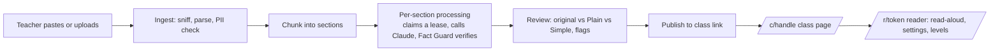

# ReadEasy

Every reading, ready for every reader.

A teacher uploads class material (a reading, article, worksheet, or assignment). ReadEasy turns it into a dyslexia-friendly version students can read, listen to, and understand, with the teacher reviewing before anything is published. The class gets one link. Students never log in.

Status: in active development. See `PLAN.md` for the current state, `BRAND.md` for the design system, `RESEARCH.md` and `DECISIONS.md` for why things are the way they are.

## Run it locally (no accounts or keys needed)

```bash
pnpm install
cp .env.example .env.local        # defaults: MOCK_DB=1, MOCK_LLM=1
NEXT_PUBLIC_DEV_TOOLS=1 pnpm dev   # http://localhost:3000
```

Paste a reading on the landing page, review the adapted version, sign in with any email (dev sign-in), create your class link, publish, and open the student link. `/styleguide` shows every component.

## Real mode

Set in `.env.local` (or Vercel env): `ANTHROPIC_API_KEY`, `DATABASE_URL` (Supabase pooler, transaction mode), `NEXT_PUBLIC_SUPABASE_URL`, `NEXT_PUBLIC_SUPABASE_ANON_KEY`, `SUPABASE_SERVICE_ROLE_KEY`, `DRAFT_COOKIE_SECRET`, `NEXT_PUBLIC_APP_URL`. Apply `supabase/migrations/0001_init.sql` to the project (`supabase db push`), set the magic-link email template from `supabase/templates/magic-link.html`, and configure custom SMTP (the built-in SMTP allows ~2 emails/hour).

## Checks

```bash
pnpm check                 # lint + typecheck + unit + RLS tests
pnpm build && MOCK_DB=1 MOCK_LLM=1 NEXT_PUBLIC_DEV_TOOLS=1 NEXT_PUBLIC_APP_URL=http://localhost:3100 pnpm start -p 3100
node scripts/smoke.mjs     # teacher + student flow in a real browser
```

## How it works



Data access is plain SQL through one interface with Postgres row-level security applied per request; PGlite runs the same migrations in tests and local dev, postgres.js talks to Supabase in production. Students never log in and never touch tables directly: public reads go through security-definer RPCs keyed by 128-bit share tokens.
