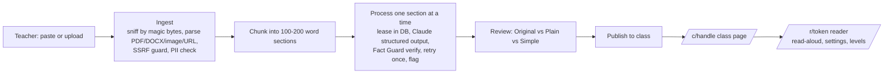

# ReadEasy

**Every reading, ready for every reader.**

A teacher uploads class material (a reading, article, worksheet, or assignment). ReadEasy turns it into a version students with dyslexia can read, listen to, and understand. The teacher reviews it, publishes it, and shares one class link. Students never log in.

Think of it as Beacons for teachers: one beautiful class link where every material is already accessible.

## What it does

**Teacher**
- Paste text or upload a PDF, Word file, photo, or text file. Try it before signing in.
- Each section is rewritten at two extra levels, **Plain** (about grade 7) and **Simple** (about grade 4). The **Original** is always one tap away.
- **Fact Guard** checks that every number, date, percentage, name, and technical term in the source still appears in each rewrite. If something is dropped, the rewrite is retried once; if it still fails, the original wording is kept for that level and the section is flagged for the teacher, naming exactly what was dropped. Flags must be acknowledged before publishing.
- TL;DR bullets, "Words to know" (with syllables, and definitions only when the text itself defines the word), and assignment steps.
- Sign in with an email link, create a class link (`/c/ms-rivera`), publish, share the link, a projector QR page, or a 6-character class code.

**Student** (no account, works on Chromebooks, iPads, and phones)
- Class page lists every published material with listen time.
- Reader: big play button, the **current sentence is highlighted** as it is read aloud, tap any sentence to start there, speed control, pause and resume.
- Tap any word to hear it, see its syllables, and a plain definition when the text gave one.
- Reading settings: font (Atkinson Hyperlegible, Lexend, OpenDyslexic), text size, letter spacing, word spacing, line spacing, line width, background (cream, pale blue, soft green, dark, high contrast), and a reading ruler. Saved on the device only.
- Level switch between Original, Plain, and Simple.

## Two ways to adapt text

- **Built-in adapter (default, no keys, no cost).** A rule-based rewriter in `src/lib/text/simplify.ts`: splits long sentences at clauses, replaces about 200 academic words and phrases with everyday ones (with correct verb forms), untangles "which" and "making" clauses, and tightens further for the Simple level. It never adds or removes facts, and Fact Guard verifies every rewrite anyway. Deterministic, runs offline, and is what the test suite uses.
- **Claude (optional).** Set `ANTHROPIC_API_KEY` and `MOCK_LLM=0` to have Claude do the rewriting with structured outputs. Higher quality, especially for the Simple level, at a few cents per material.

## Run it locally (no keys needed)

```bash
pnpm install
cp .env.example .env.local            # defaults to MOCK_DB=1 and MOCK_LLM=1
NEXT_PUBLIC_DEV_TOOLS=1 pnpm dev      # http://localhost:3000
```

Mock mode runs a real Postgres in-process (PGlite) with the same migrations and row-level security as production, and uses the built-in rule-based adapter for rewriting. Sign in with any email through the dev sign-in. `/styleguide` shows every component.

## Deploy (Vercel + Supabase + Anthropic)

1. **Supabase**: create a project. In the SQL editor run `supabase/migrations/0001_init.sql` (or `supabase link` then `supabase db push`). Create a Storage bucket named `uploads` (private). In Authentication → Email Templates, set the Magic Link template to `supabase/templates/magic-link.html`. In Authentication → URL Configuration, set the site URL to your domain and add `https://<your-domain>/auth/confirm` to the redirect list. **Configure custom SMTP** (Resend, Postmark, etc.): the built-in sender allows about 2 emails per hour.
2. **Vercel**: import the GitHub repo. Framework: Next.js. Set these environment variables:

| Variable | Where to get it |
|---|---|
| `ANTHROPIC_API_KEY` | console.anthropic.com |
| `LLM_MODEL` | optional, default `claude-sonnet-5-5` |
| `DATABASE_URL` | Supabase → Project settings → Database → Connection pooling, **transaction** mode (port 6543) |
| `NEXT_PUBLIC_SUPABASE_URL` | Supabase → Project settings → API |
| `NEXT_PUBLIC_SUPABASE_ANON_KEY` | same page |
| `SUPABASE_SERVICE_ROLE_KEY` | same page (server only) |
| `DRAFT_COOKIE_SECRET` | any 32+ random characters (`openssl rand -base64 32`) |
| `NEXT_PUBLIC_APP_URL` | `https://<your-domain>` with no trailing slash |

Leave `MOCK_DB` and `MOCK_LLM` unset in production. Do not set `NEXT_PUBLIC_DEV_TOOLS` in production.

3. Deploy. Open `/api/health`: it should return `{"ok":true,"db":"postgres","llm":"anthropic"}`. Pushes to `main` redeploy automatically.

## Checks

```bash
pnpm check        # lint, typecheck, unit tests, RLS policy tests (PGlite)
pnpm build
MOCK_DB=1 DRAFT_COOKIE_SECRET=local-secret-local-secret NEXT_PUBLIC_DEV_TOOLS=1 NEXT_PUBLIC_APP_URL=http://localhost:3100 pnpm start -p 3100
node scripts/smoke.mjs   # full teacher + student flow in a real browser; screenshots in test-shots/
```

GitHub Actions runs all of this on every push (`.github/workflows/ci.yml`).

## Architecture



- **Next.js 16 App Router, TypeScript strict, Tailwind v4.** Every color, size, and spacing value lives in `src/styles/tokens.css`; a test fails the build on raw colors anywhere else, on deficit language in copy, and on any text token under 4.5:1 contrast.
- **Data**: plain SQL through one interface (`src/lib/db`) that sets `request.jwt.claims` and `set local role` per request, so Postgres row-level security applies exactly as it would through Supabase's API. `postgres.js` talks to Supabase in production; PGlite runs the same migrations in tests and local dev. Students never read tables: public pages call `security definer` RPCs keyed by 128-bit share tokens, cached and invalidated on publish.
- **Processing is resumable**: sections carry a status and a lease. The client calls `POST /api/materials/[id]/process` until done; closing the tab, refreshing, or a second tab just continues the same work. One failed section never fails the material.
- **Rewriting**: the built-in rule-based adapter by default; optionally `@anthropic-ai/sdk` with structured outputs (zod schemas), where uploaded content is wrapped as data inside `<document>` tags and the prompt states it is never instructions.
- **Read-aloud**: browser Web Speech API behind a small interface (`src/lib/tts`). One utterance per sentence, chained, which avoids Chrome's long-utterance cutoff and gives sentence highlighting on every platform; word underline uses boundary events where they exist and a timing estimate elsewhere. iOS needs the first play inside a tap, which the reader does.
- **Security**: nonce-based CSP, HSTS, frame-ancestors none, no HTML ever stored or rendered from content, magic-link sign-in via `token_hash` (works across devices), rate limits and daily caps in Postgres, uploads go straight to Storage via signed URLs (never through a function), URL import blocks private networks.

## Repository guide

| File | What it is |
|---|---|
| `PLAN.md` | Current state and what was cut. Start here to continue the work. |
| `BRAND.md` | The design system: mark, palette with contrast ratios, type, motion, voice. |
| `RESEARCH.md` | Evidence behind the reading-support choices, competitor analysis, technical findings. |
| `DECISIONS.md` | Every major decision, who made it, and why. |
| `DEMO.md` | The 2-minute demo script and judge Q&A. |
| `PRIVACY.md` | How student privacy is handled. |

## Known limitations

- Quick checks are generated and validated but not yet shown in the reader.
- Cross-browser automated runs (WebKit, Firefox), load tests, and Lighthouse CI are not wired up; the smoke test runs on Chromium.
- Materials created without an account live in a signed cookie for 7 days; sign in to keep them.
- Fonts are offered as preferences. The evidence does not support any font as a treatment for dyslexia (see RESEARCH.md §1.5).

## License

MIT. OpenDyslexic is included under the SIL Open Font License (see `src/fonts/OpenDyslexic-OFL.txt`).
